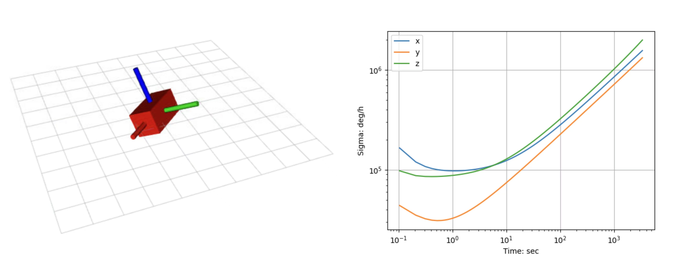
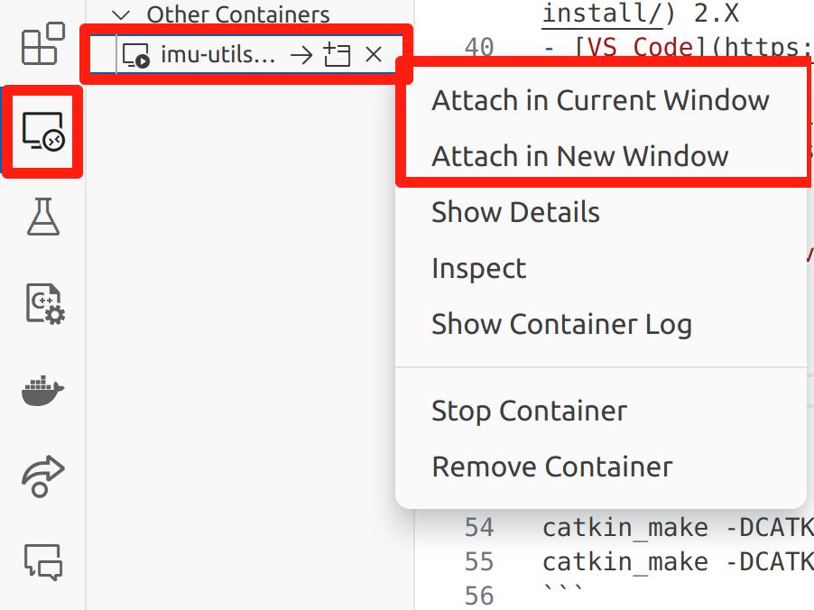
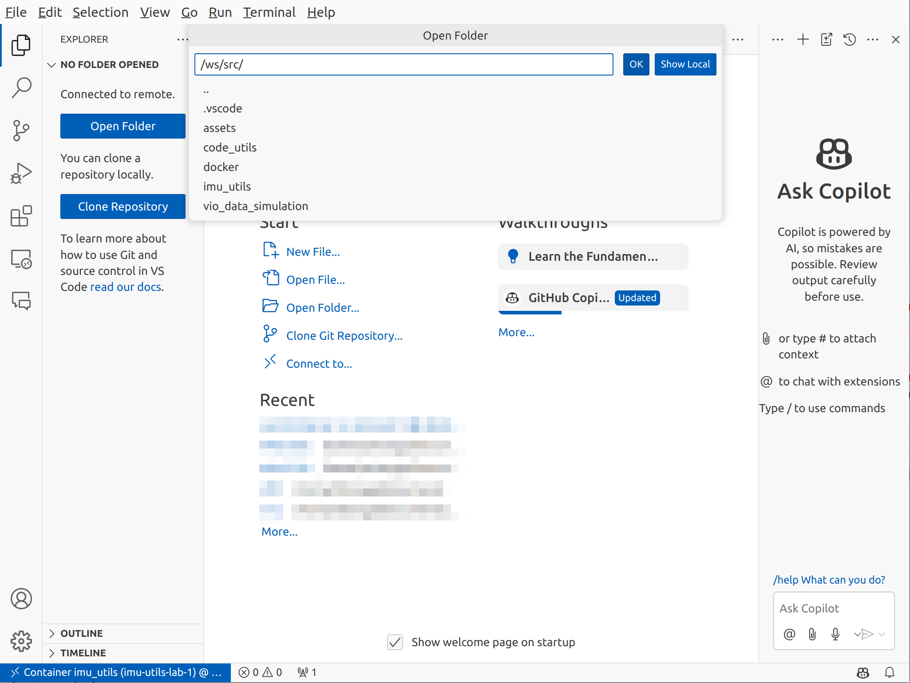
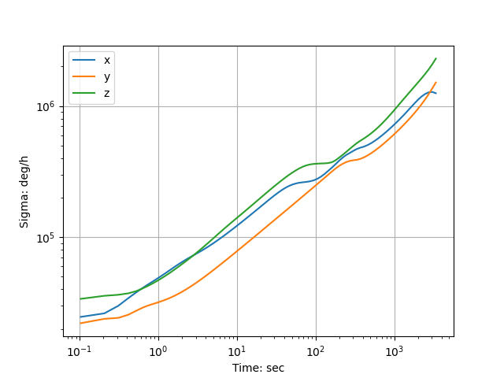

## IMU Utils

### A ROS toolkit for imu data simulation, zero-drift calibration and their joint simulation.




**Highlights:**

- Resolved code adaptability issues mentioned in the issues of `imu_utils` and `code_utils`
- Integrated Python code for visualizing Allan curves
- Provided instructions for building the corresponding Docker container and code for a node that generates simulated IMU data, making the entire tool ready to use *out of the box*

### All code sources

| Module | Source |
| - | - |
|`imu_utils`|https://github.com/gaowenliang/imu_utils|
|`code_utils`|https://github.com/gaowenliang/code_utils|
|`vio_data_simulation`|https://github.com/HeYijia/vio_data_simulation/tree/ros_version|

### All changes to the code

1. `code_utils/src/*.cpp`: modify `CV_MINMAX` to `CV_MMX`, modify `CV_LOAD_IMAGE_UNCHANGED` to `IMREAD_UNCHANGED`
2. `code_utils/CMakeLists.txt`: add include path `include_directories("include/code_utils")`
3. Create `imu_utils/launch/imu.launch` to get imu data from `rosbag play`
4. `vio_data_simulation/src/imu.cpp/IMU::testImu()`: modify Euler integral to median integral
5. Modify `imu_utils/scripts/*.m` to `imu_utils/scripts/matlab/*.m` and add `imu_utils/scripts/python/*.py`

### How to use

#### Environment prepare

- ROS 1
- OpenCV
- Ceres 2.2.0
- Boost

**or Docker**:

- [Docker Enginer](https://docs.docker.com/engine/install/)
- [Docker Compose](https://docs.docker.com/compose/install/) 2.X 
- [VS Code](https://code.visualstudio.com/) (Recommend)
    - Docker
    - Remote Development
    - C/C++ Extension Pack

```bash
chmox +x start_dev.sh
bash start_dev.sh
```





#### Compile Source Code

```
cd /ws
catkin_make -DCATKIN_WHITELIST_PACKAGES="code_utils" 
catkin_make -DCATKIN_WHITELIST_PACKAGES="imu_utils"
catkin_make -DCATKIN_WHITELIST_PACKAGES="ros_imu"
catkin_make
```

#### Simulation

```bash
cd /ws
source devel/setup.bash
rosrun vio_data_simulation vio_data_simulation_node
```

```bash
cd /ws
source devel/setup.bash
roslaunch imu_utils imu.launch
```

```bash
rosbag play -r 500 /root/imu.bag
```

```bash
cd src/imu_utils/scripts/python
python3 draw_allan.py
```


#### Real IMU

If you cannot find `/dev/ttyUSB0`, this page may help: https://askubuntu.com/questions/1403705/dev-ttyusb0-not-present-in-ubuntu-22-04

```bash
cd /ws
source devel/setup.bash
roslaunch imu_utils im10a.launch
```

```bash
cd /ws
source devel/setup.bash
roslaunch ros_imu imu.launch
```

Then just waiting for `imu_utils` to finish



